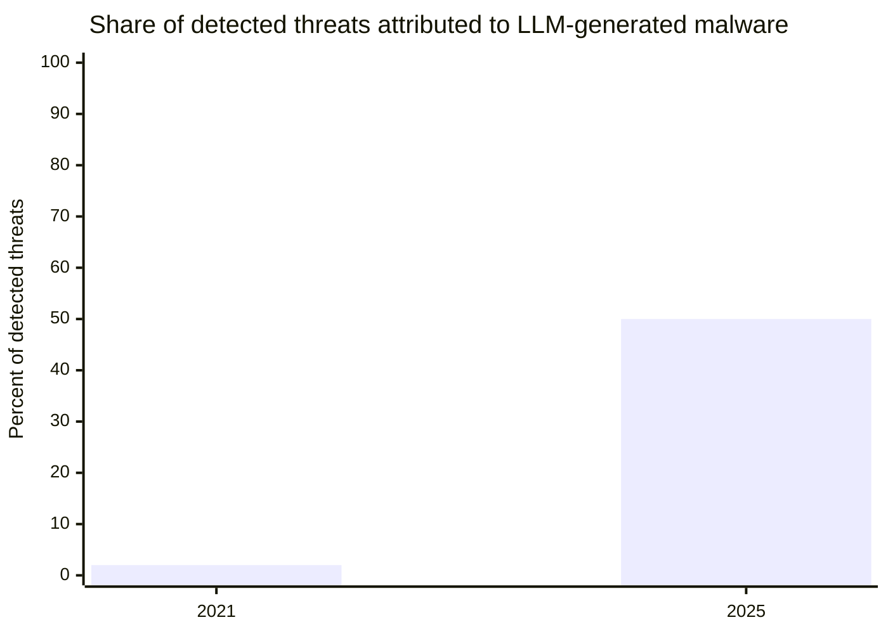

# linux-cryptojack-hunter

A detection and cleanup script for a family of cryptojacking malware that kept reinfecting one of my servers over the course of two weeks. Each time it came back wearing a different disguise, but always with the same skeleton underneath. I documented the process because every reinfection taught me something new about how this kind of kit hides itself, and the script grew out of that.

## How this started

I noticed the first sign by accident. A task that normally took a couple of seconds started hanging, and `uptime` showed a load average that made no sense for a single-core VPS. `ps aux` turned up two processes eating more than 170% of CPU combined. One was called `dashboard`, running out of `/tmp` with a config file next to it (`v.json`). The other had a random 8 character name and no matching executable on disk at all (it had already deleted itself, but kept running from memory).

The `v.json` matched an XMRig config on sight, a Monero miner pointed at a public pool. The random named process had an active network connection to an IP on a port that had nothing to do with any legitimate service. I killed both, cleaned up the files, and moved on.

I thought that was the end of it. It wasn't.

## The reinfection, and a deliberate choice

Six hours later the same symptoms came back. High CPU, same kind of process, same behavioral family. That changes the question from "what is this" to "why does this keep coming back when I did nothing wrong in between".

At this point I made a decision that shapes the rest of this writeup: I did not rotate the root password. Not because I overlooked it, but because I wanted to see how far this thing would go and how it would adapt between cleanups. Treating the box as a live observation target, rather than patching the hole immediately, is what let the rest of this story happen.

The answer to "why does it keep coming back" showed up in layers, with each reinfection revealing a different persistence mechanism:

* A crontab recreating an administrative user every 30 minutes.
* A systemd service disguised as a "System Service Manager", which downloaded and re-executed a remote script.
* A cron job named after a legitimate system task, hiding an entire payload encoded in base64.
* And, more concerning: a hook in `/etc/ld.so.preload`, the classic way a userland rootkit intercepts system calls (`readdir`, specifically) to hide processes and files from anything that lists them. The library file predated my first cleanup by days, which changes the whole interpretation: these might not have been separate reinfections at all, but a single resident compromise quietly relaunching the visible payload every time I killed the previous one.

## The most interesting find

During a deeper investigation late one night, I found the most sophisticated watchdog mechanism yet: a systemd service with a generic name and a fake description of "Kernel Thread Daemon", running a loop that checked every 5 minutes whether a specific process existed, and if not, executed a hidden script (`.khp`, a dotfile tucked inside `/bin`) to relaunch everything.

That relaunch script had five fallback download sources, tried in order until one worked. The first two were plain IPs. The next two were `.eth` domains, resolved through an IPFS gateway rather than a traditional domain registrar. This is a real technique called EtherHiding: hosting C2 infrastructure on a public blockchain, because there is no taking down a record that has already been written to an immutable, distributed ledger. Finding that on a five dollar a month VPS was the moment I realized this was not a bored teenager's script anymore. It is campaign tooling, and quite likely AI assisted to some degree. LLM generated malware went from about 2% of detected threats in 2021 to a projected 50% in 2025.



While investigating the entry vector, I found something else. The authentication logs showed no successful login at all during the window when the latest persistence mechanism was installed. For a moment I assumed the server had rebooted, but `uptime` proved otherwise. The systemd journal log for that exact minute read, literally, "Journal file has been deleted, rotating": someone with root access had deleted the log on purpose, and systemd simply recreated an empty one afterward. Active anti forensics, not a system event.

## The script, and the mistakes that came with it

The script started simple: a list of known indicators (IPs, domains, known filenames) and two actions, kill the processes and remove the files. It grew as each reinfection revealed a new pattern that needed generic detection instead of a static list, because the process or service name changes every single time.

Three times, while adding a new check, I caused or nearly caused real damage:

1. A cron checking function had its return logic inverted. In shell, exit code 0 means success, not "nothing found". The bug made the script delete a file exactly when it was clean. I ran it in production without noticing and deleted two legitimate cron jobs (SSL certificate renewal and a filesystem check). I recovered them by extracting the original content straight from the cached `.deb` packages, no guessing involved.
2. A check meant to detect processes masquerading as kernel threads (the malware uses names like `ksmd`, a real Linux kernel thread, to blend into a quick `ps aux`) used the wrong test to decide what counted as fake. It would have killed `kthreadd`, the process that spawns every kernel thread on the system. Running that version in kill mode would have taken down the entire kernel on the VPS.
3. After finding the malware's own install script running live out of a web app's own directory (not a system path this tool had ever scanned before), I extended the "any hidden dotfile is malware" rule from system binary directories to app roots too. That rule is true for `/bin`, and completely false for an app root: `.env`, `.gitignore`, and a dozen other dotfiles belong there. Running `--kill` deleted the `.env` file of five different production apps in one pass. This one was not caught in report mode first, it happened. The apps stayed up only because the already-running processes still had their old environment in memory; restarting any of them before the files were restored would have taken them down. Recovering the exact original values turned out to only be partly possible from a live process's own environment.

The first two were caught because of a rule I adopted after the first scare: every change to the script runs in report-only mode, in a real session, before it is ever allowed to delete anything. That rule is necessary but, as the third one showed, not sufficient: report mode only tells you a check fires on the thing you expected it to fire on, not that the rule behind it is still true in the new place you just pointed it at. A broad heuristic (a generic text pattern, or "any dotfile") never authorizes automatic removal by itself, except when the exact same heuristic is quietly true in one context and false in another and nothing forces you to notice the difference. Only a specific, confirmed indicator (an exact domain, IP, hash, or filename) does, and "confirmed" has to be re-earned for every new place a check gets pointed at, not assumed to carry over.

## What the script does today

Indicators live in `iocs.conf`, sourced at runtime, not hardcoded in the script. Tracking a different campaign, or extending this one, means editing that file (or pointing `--iocs` at your own copy), never the engine itself.

Every finding is scored CONFIRMED or WARNING. CONFIRMED means a specific indicator matched (an exact domain, IP, username, file signature) and `--kill` is allowed to act on it; it is also the only thing that makes the script exit non-zero, so a cron wrapper can alert on real signal without paging on WARNING-only noise. WARNING means a generic behavioral pattern matched that shows up in legitimate setups too, so it is only ever reported, never removed automatically.

Checks:

* High-CPU processes running from `/tmp` or `/var/tmp`.
* Processes with the name of a real kernel thread but a non-empty `cmdline` (a real kernel thread never has command line arguments, the same test `ps` uses internally).
* Running processes whose backing binary has since been deleted, when it originally lived somewhere suspicious (self-deletion after launch is a common way to leave nothing on disk to scan).
* Hidden executable files in system binary directories (`/bin`, `/usr/bin`, `/sbin`, `/usr/sbin`), where legitimate packages never install dotfiles. This rule does not extend past system directories, see the third mistake below for why.
* A short list of known loader filenames (deliberately boring names instead of hidden ones, e.g. an install script sitting as a plain file named `idle`), matched by exact name rather than by "is a dotfile". Checked in system binary directories and in `EXTRA_SCAN_DIRS` (`iocs.conf`, defaults to common web app root patterns), since a web app's own directory turned out to be as good a drop point as `/tmp` once something can write to it.
* Running processes whose command line matches a self-relaunch invocation (`/bin/sh /bin/<name> <target> /bin/<target>`, a loader calling itself with the target process name repeated as an argument), read directly from `/proc/PID/cmdline` rather than through `ps -e`. One incident behind this repo had a process `ps -e` never listed at all, even though `/proc/PID/status` answered fine for the same PID (cause unconfirmed, root cause was not the `ld.so.preload` rootkit this time; the point is `/proc` is the ground truth `ps` is built on, so this check does not depend on `ps` correctly enumerating every PID).
* `/tmp` or `/var/tmp` carrying the immutable or append-only attribute. Neither is ever legitimate on a scratch directory; one incident behind this repo used it to break defensive tooling (including the system's own package manager) as a side effect.
* A logging or audit binary (`rsyslogd`, `auditd`, `journalctl`, `systemd-journald`) carrying the immutable attribute. It does not touch a single log line by itself, but it silently kills the daemon the next time a routine package update tries to replace it, and a dead syslog daemon means an entire log source goes dark with nothing on the surface looking tampered with.
* `chattr` missing while `lsattr` is still present. The two ship in the same package, so this asymmetry does not happen by normal wear, only by someone specifically removing the one tool a defender would need to lock files back down. `--kill` reinstalls the package automatically (routing around a locked `/tmp` if needed) before the `/tmp`/`/var/tmp` check below runs, so one pass fixes both instead of requiring a manual reinstall in between.
* Active network connections to any known C2 IP from this campaign, plus a broader, unconfirmed check for connections to common mining-pool ports.
* A rootkit hook through a non-empty `/etc/ld.so.preload`.
* Miner configs (XMRig signature) in temp directories.
* Known backdoor usernames.
* systemd services matching a disguised watchdog pattern by unit file content (a reference to a hidden dotfile, or a self-checking loop using `pgrep`/`pidof`), not by name, since the name changes every time.
* Every user's crontab and `/etc/cron.d`, decoding any base64 payload before comparing it against known domains and C2 IPs, since this campaign's dropper does not always appear in plain text. Also matches a self-healing watchdog disguised as a cron entry instead of a systemd unit: a liveness probe (`kill -0`, `pgrep`, `pidof`, or a specific `/proc/net/tcp` connection) combined with a curl/wget-to-shell fallback in the same line. A confirmed match clears the whole crontab, the same way a confirmed `/etc/cron.d` file gets deleted outright.
* Optionally (`--deep`), binaries in system directories not owned by any installed package, the same idea behind `debsums`/`rpm -Va`. Off by default because it is noticeably slower.

Files that carry the immutable attribute (`chattr +i`, another trick to survive a cleanup) are unlocked before removal.

`./check-infection.sh` only reports. `./check-infection.sh --kill` acts on anything CONFIRMED. `--json` emits findings as a JSON array for feeding into something else. `--log FILE` appends a plain-text report to a file.

## Indicators of compromise

C2 and mining IPs observed:
```
57.129.119.218   193.32.162.73   45.86.86.254
51.81.211.221    47.86.46.179    34.70.205.211
69.30.251.156     216.98.10.60
```

Dropper domains:
```
0x1x2x3.top
c3pool.org
kworker.eth.limo
kworker.eth.link
```

XMRig wallet observed:
```
46t3NBUSK5bJBcf6zSvrViGBe1k7N7p2rG3PKT2vMYpHVLSXf4bt3kRfR43ToVH77FcMnvngBNRpFQH31LUxGdCLQSwT295
```

Process and binary names seen over time (all random or masqueraded, do not trust the name, trust the behavior): `dashboard`, `ksmd` (impostor), and random 8 to 9 character alphanumeric strings.

## Why this matters beyond my case

The root cause never changed across any of the reinfections: a reused password, password authentication enabled over SSH. Every layer of disguise got more sophisticated, from an obvious backdoor user to a watchdog with a blockchain fallback, but the door it walked through was always the same trivial one. This is not a campaign targeting this server specifically. It is mass scanning of the internet, blind to whatever runs on each machine, aimed only at the lowest common denominator of any misconfigured box.

If you ended up here because you found a strange process eating CPU on your own server, there is a decent chance it is the same family. Run the script, and if you find something it does not cover yet, a PR is welcome.

## Usage

```bash
chmod +x check-infection.sh
./check-infection.sh              # report only, safe, changes nothing
./check-infection.sh --kill       # acts on anything CONFIRMED
./check-infection.sh --deep       # also checks for unowned binaries (slower)
./check-infection.sh --json       # machine-readable output
./check-infection.sh --log out.txt --iocs my-campaign.conf
```

I strongly recommend always running report mode first, including after any change to the script or to `iocs.conf`.

## License

MIT.
